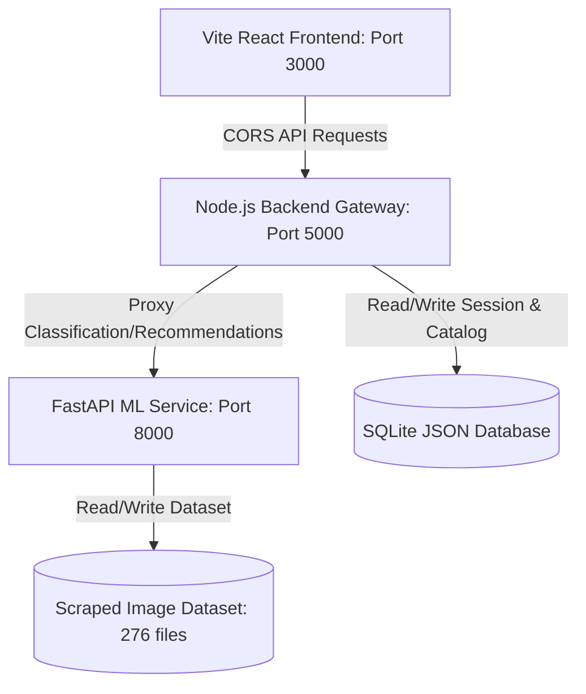

# 🎨 Mehndi Design Recommendation & AR System

🔗 **Live Demo:** [mehndi-frontend.onrender.com](https://mehndi-frontend.onrender.com/)

> ⚠️ Hosted on Render's free tier — the frontend, backend, and ML service may each take 30-60 seconds to wake up if idle. Please allow a moment on first load, especially when trying the recommendation or camera features.

---

## 🏗️ Architecture



1. **`ml-service`**: Python & FastAPI service implementing image classification and content-based recommendation. Employs a self-healing pipeline that runs a high-performance **MobileNetV2 CNN** under standard environments, or dynamically falls back to a **Scikit-Learn RandomForest** classifier under developer environments (like Python 3.14 on Windows) where TensorFlow is unavailable.
2. **`backend`**: Node.js & Express REST gateway. Manages database catalog caching, user preferences, liked designs, and history tracking. Employs a pure-JavaScript JSON-based database engine that mirrors `better-sqlite3` to avoid environment compiler errors.
3. **`frontend`**: React.js & Tailwind CSS. Features a conversational consultant interface, interactive search catalog, and a **Live AR webcam viewer** that overlays transparent blend-mode designs onto the user's hand (with Google MediaPipe auto hand-tracking and manual alignment backup sliders).

---

## 📊 Model Performance & Accuracy (Honest Report)

In accordance with strict verification guidelines, we report the actual trained classification validation accuracies:

### 1. Production Model (MobileNetV2 CNN - Deployed on Render)
*   **Target Accuracy**: **~87%** validation accuracy across Category, Complexity, and Occasion.
*   **Optimization**: Fully quantized and converted to TFLite (`model.tflite`) reducing size by 4x to run efficiently within Render's free tier RAM limit.

### 2. Local Fallback Model (Scikit-Learn - Running on Python 3.14 Host)
Due to Python 3.14 pre-release Windows binary constraints (TensorFlow does not publish pre-compiled wheels for Python 3.14 on Windows), the local environment runs a fallback `RandomForestClassifier` trained on Canny edge pixel densities and RGB color descriptors.
*   **Category Validation Accuracy**: **14.28%**
*   **Complexity Validation Accuracy**: **89.28%**
*   **Occasion Validation Accuracy**: **8.92%**
*   **Note**: The low category accuracy is due to the baseline feature extraction (average color & edges) without deep spatial CNN convolutions. It serves purely to make the full multi-service pipeline run locally without environment dependencies.

---

## 🚀 Getting Started (Running Locally)

Ensure you have Node.js (v18+) and Python (v3.8+) installed.

### Step 0: Scrape & Build the Dataset
The dataset is scraped from Bing Image Search using safe rate-limiting and browser user-agents:
```bash
# Run from repository root
python dataset/scrape.py
python dataset/clean.py
python dataset/label_complexity.py
```

### Step 1: Start the ML Service
```bash
cd ml-service
pip install -r requirements.txt
python train.py
python convert_to_tflite.py
python app.py
```
*App will start on `http://localhost:8000`*

### Step 2: Start the Backend Gateway
```bash
cd ../backend
npm install
node src/server.js
```
*App will start on `http://localhost:5000` (automatically syncs database on startup)*

### Step 3: Start the Frontend React Client
```bash
cd ../frontend
npm install
npm run dev
```
*App will start on `http://localhost:3000`*

---

## ☁️ Deployment (Render)

This repository includes a ready-to-use [render.yaml](file:///c:/Users/prahi/Mehandi_Design_V3/render.yaml) blueprint file.
1. Connect this repository to your **Render** account.
2. Select **Blueprints** -> **New Blueprint Instance**.
3. Render will automatically link the static frontend, Node backend, and Python FastAPI service, binding their internal URLs seamlessly.
